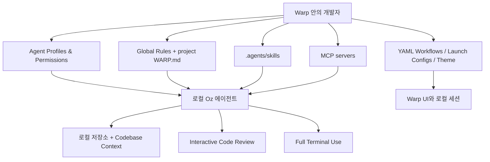
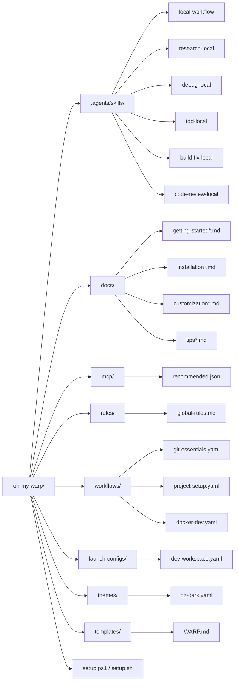

# oh-my-warp

[](LICENSE)
[](https://warp.dev)

> **Your Warp is not alone.**

[English](README.md) | **한국어**

`oh-my-warp`는 **공식 Warp / Oz 로컬 기능**만으로 더 강한 개발 환경을 구성하기 위한 로컬 중심 확장 키트입니다.

문서화되지 않은 내부 경로, 커스텀 훅 엔진, tmux 워커 오케스트레이션, 보조 런타임에 기대지 않고도 Warp를 체계적으로 쓸 수 있도록 설계했습니다.

## 왜 이 저장소가 필요한가

에이전트 파워유저 설정은 보통 다음 세 가지가 섞여 버립니다.

1. **공식 Warp 기능**
2. **개인 shell / tmux 자동화**
3. **도구별 비공개 관례나 우회 설정**

그러면 무엇이 진짜 이식 가능하고, 팀에 공유 가능하고, 유지보수 가능한지 구분하기 어려워집니다.

`oh-my-warp`는 반대로 갑니다.

- **로컬 우선**
- **공식 문서 기반**
- **작고 검증 가능한 diff**
- **macOS / Windows / Linux 모두 고려**

## 범위

### 포함하는 것

이 저장소는 현재 Warp가 문서화한 로컬 표면에 집중합니다.

- 재사용 가능한 **Skills**
- 지속적인 **Rules**
- 도구 / 플러그인 계층으로서의 **MCP 서버**
- **Agent Profiles & Permissions**
- 내장 **Planning** 과 **Task Lists**
- **Full Terminal Use**
- **Interactive Code Review**
- **Codebase Context**
- **YAML Workflows**
- **Launch Configurations**
- 로컬 **Oz CLI**

### 의도적으로 제외한 것

이 저장소는 다음에 의존하지 않습니다.

- 문서화되지 않은 Warp 내부 디렉토리
- 커스텀 훅 엔진
- tmux 기반 워커 오케스트레이션
- 별도 컨트롤 플레인이나 런타임
- 숨겨진 상태 파일 / 백그라운드 데몬
- 네이티브 기능 부족을 메우기 위한 서드파티 우회 래퍼

## 구조 한눈에 보기



## 저장소 codemap

이 다이어그램은 저장소가 어떤 역할 단위로 나뉘어 있는지 보여줍니다.



## 구성 요소

| 구성 요소 | 설명 | 수량 |
|-----------|------|------|
| **Native-only 스킬 팩** | 공식 탐색 경로에 맞춘 로컬 Oz 스킬 | 6개 스킬 |
| **WARP.md 템플릿** | 로컬 Oz 워크플로우용 프로젝트 규칙 템플릿 | 1개 템플릿 |
| **Workflows** | git, docker, 프로젝트 설정용 재사용 커맨드 | 3개 워크플로우 |
| **Theme** | 틸 액센트의 다크 테마 | 1개 테마 |
| **Launch config** | 멀티탭 로컬 워크스페이스 레이아웃 | 1개 설정 |
| **Global rules** | Warp Drive에 추가할 규칙 | 9개 규칙 |
| **MCP configs** | 유효한 로컬 MCP 서버 설정 | 7개 서버 |
| **가이드 문서** | 설치, 커스터마이징, 시작하기, 파워팁 문서의 영문/국문 세트 | 8개 문서 |

## 요구사항

- [Warp 터미널](https://warp.dev) 설치 및 실행
- Git
- (선택) Node.js — `npx`를 사용하는 MCP 서버용
- (선택) Docker — GitHub MCP 서버용
- (선택) Oz CLI — Warp에 포함되며 헤드리스 로컬 실행에 유용

## 빠른 시작

> **처음이라면** 다음 문서부터 보세요:
> - [Getting Started (English)](docs/getting-started.md)
> - [시작하기 (한국어)](docs/getting-started-ko.md)

### Windows (PowerShell)

```powershell
git clone https://github.com/hongvincent/oh-my-warp.git
cd oh-my-warp
.\setup.ps1
```

### macOS / Linux

```bash
git clone https://github.com/hongvincent/oh-my-warp.git
cd oh-my-warp
chmod +x setup.sh
./setup.sh
```

## 무엇이 어디에 설치되나

| 표면 | Windows | macOS | Linux |
|------|---------|-------|-------|
| **Skills** | `%USERPROFILE%\\.agents\\skills\\` | `~/.agents/skills/` | `~/.agents/skills/` |
| **Workflows** | `%APPDATA%\\warp\\Warp\\data\\workflows\\` | `~/.warp/workflows/` | `~/.local/share/warp-terminal/workflows/` |
| **Themes** | `%APPDATA%\\warp\\Warp\\data\\themes\\` | `~/.warp/themes/` | `~/.local/share/warp-terminal/themes/` |
| **Launch configs** | `%APPDATA%\\warp\\Warp\\data\\launch_configurations\\` | `~/.warp/launch_configurations/` | `~/.local/share/warp-terminal/launch_configurations/` |
| **WARP.md 템플릿** | `%USERPROFILE%\\.warp\\templates\\` | `~/.warp/templates/` | `~/.warp/templates/` |

## 설치 후 첫 10분

1. **글로벌 룰 추가**
   - Warp를 엽니다
   - `/add-rule`을 입력합니다
   - `rules/global-rules.md` 내용을 붙여넣습니다

2. **MCP 서버 추가**
   - Warp의 MCP 서버 설정을 엽니다
   - `mcp/recommended.json`을 가져오거나 추가합니다
   - 처음에는 **Context7** 하나만 써도 충분합니다

3. **프로젝트에 `WARP.md` 복사**
   - 설치된 `~/.warp/templates/WARP.md` 또는 `%USERPROFILE%\.warp\templates\WARP.md`를 사용합니다
   - `[CUSTOMIZE]` 섹션에 실제 프로젝트 정보를 채웁니다

4. **프로필 생성**
   - Prod mode: 신중하거나 민감한 작업
   - Default: 일반 로컬 코딩
   - YOLO mode: 충분히 신뢰하는 샌드박스 전용

5. **원하는 표면만 켜기**
   - theme
   - launch configuration
   - workflows
   - 실제로 필요한 MCP 서버

## 스킬 팩

모든 번들 스킬은 **문서화된 로컬 Oz 기능만** 사용하도록 설계했습니다.

| 스킬 | 용도 | 대표 프롬프트 |
|------|------|---------------|
| `local-workflow` | 구조화된 explore → plan → execute → verify 로컬 작업 | `/local-workflow 설치 문서를 갱신하고 검증까지 해줘.` |
| `research-local` | MCP + 코드베이스 컨텍스트 기반 문서/API 조사 | `/research-local 현재 SDK 사용 방식과 최신 문서를 비교해줘.` |
| `debug-local` | 문제 재현, 원인 분석, 수정, 재검증 | `/debug-local 설정 페이지에서 dev server가 죽어요.` |
| `tdd-local` | 테스트 우선 구현 루프 | `/tdd-local 빈 이메일 입력 검증을 추가해줘.` |
| `build-fix-local` | 빌드, 린트, 타입체크 오류를 최소 diff로 복구 | `/build-fix-local 현재 타입체크 실패를 최소 수정으로 고쳐줘.` |
| `code-review-local` | 로컬 diff를 코드 리뷰 흐름으로 점검 | `/code-review-local 현재 diff의 위험 요소를 리뷰해줘.` |

## 이 저장소가 Warp 기능과 연결되는 방식

| 저장소 아티팩트 | 연결되는 Warp 기능 | 존재 이유 |
|-----------------|--------------------|-----------|
| `.agents/skills/` | Skills | 로컬 Oz 작업용 재사용 workflow |
| `rules/global-rules.md` | Rules / Warp Drive | 지속적인 제약과 기대치 |
| `templates/WARP.md` | Project rules | 프로젝트별 컨텍스트 제공 |
| `mcp/recommended.json` | MCP servers | 문서, GitHub, 외부 도구 연결 |
| `workflows/*.yaml` | YAML workflows | 반복 명령을 Warp UI에서 재사용 |
| `launch-configs/*.yaml` | Launch configurations | 멀티탭 로컬 워크스페이스 |
| `themes/*.yaml` | Themes | 일관된 Warp 외형 |
| `setup.ps1`, `setup.sh` | Installation | 공식 디렉토리에 자산 복사 |

## 일상적인 사용 패턴

### 1. 새 저장소에서 시작하기

- 키트를 설치합니다
- `WARP.md`를 복사합니다
- 글로벌 룰을 추가합니다
- 실제로 필요한 MCP 서버만 켭니다
- Warp에서 저장소를 열고 Codebase Context 인덱싱이 끝나길 기다립니다

### 2. 구조화된 구현 진행

```text
/plan 로컬 설치 흐름을 공식 스킬 경로 기준으로 정리하는 계획을 세워줘.
```

```text
/local-workflow 승인된 계획의 1단계만 구현하고 검증까지 해줘.
```

### 3. 코딩 전에 조사하기

```text
/research-local Context7로 최신 프레임워크 문서를 확인한 뒤 현재 통합 방식을 비교해줘.
```

### 4. 빌드 실패 고치기

```text
/build-fix-local 현재 build/typecheck 실패를 실행해보고, 관련 에러를 묶어서 최소 수정으로 고쳐줘.
```

### 5. 현재 diff 리뷰하기

```text
/code-review-local 현재 diff의 논리 위험, 빠진 테스트, 검증 누락을 검토해줘.
```

### 6. CLI로 헤드리스 실행하기

```bash
oz agent run --prompt "저장소 구조를 요약하고 안전한 첫 작업을 제안해줘"
```

```bash
oz agent run --mcp ./mcp/recommended.json --prompt "코드 수정 전에 최신 SDK 문서를 먼저 확인해줘"
```

## 크로스플랫폼 메모

이 저장소는 의도적으로 플랫폼 차이를 줄이도록 설계했습니다.

- **Windows는 `setup.ps1`** 를 통해 문서화된 사용자 레벨 Warp 디렉토리에 설치합니다.
- **macOS / Linux는 `setup.sh`** 를 사용하지만 스킬 경로는 동일한 공식 레이아웃을 따릅니다.
- **프로젝트 setup workflow** 는 가능한 한 POSIX 전용 구문을 피하도록 다시 썼습니다.
- **Git branch cleanup** 은 shell 의존 삭제 파이프라인 대신, 어떤 shell에서도 볼 수 있는 후보 listing 형태로 제공합니다.
- **Launch config 색상값** 은 문서화된 값만 사용합니다.
- **문서 예시** 는 Windows 경로와 복사 예시를 함께 제공합니다.

## 디렉토리별 안내

### `.agents/skills/`

이 저장소의 핵심입니다.

- `local-workflow` — 일반 구현 작업의 기본 규율
- `research-local` — 문서 우선 조사
- `debug-local` — reproduce → diagnose → fix → verify
- `tdd-local` — red → green → refactor
- `build-fix-local` — build/test/typecheck 오류 최소 복구
- `code-review-local` — 구조화된 diff 점검

### `docs/`

사람이 읽는 안내 문서 모음입니다.

- `getting-started*.md` — 첫 실행 경로
- `installation*.md` — OS별 설치 경로와 수동 단계
- `customization*.md` — 스킬, workflow, theme 확장 방법
- `tips*.md` — profiles, MCP, planning, code review 같은 파워유저 가이드

### `mcp/recommended.json`

Warp에 가져오거나 `oz agent run --mcp`로 직접 넘길 수 있는 유효한 MCP 설정 번들입니다.

### `rules/global-rules.md`

Warp Drive에 넣을 글로벌 룰 모음입니다. 저장소를 넘나드는 기본 행동 원칙을 잡아줍니다.

### `workflows/`

다음 범주의 YAML workflow가 들어 있습니다.

- git inspection / commit helper
- docker 개발 루프
- 프로젝트 초기화 작업

### `launch-configs/dev-workspace.yaml`

코딩, 서버, 테스트, 일반 터미널 작업을 위한 시작용 멀티탭 워크스페이스입니다.

### `templates/WARP.md`

프로젝트 레벨 규칙 템플릿입니다. 스킬 팩 다음으로 효과가 큰 파일입니다.

## 검증 모델

이 저장소는 검증을 강하게 요구합니다.

확장하거나 수정할 때 기본 기대 순서는 다음과 같습니다.

1. **먼저 탐색**
2. **복잡하면 계획**
3. **최소 diff로 구현**
4. **완료 전 검증**

실제로는 보통 다음 순서를 따릅니다.

1. build / compile
2. lint / typecheck
3. tests
4. 원래 요청에 대한 기능 적합성 확인

## 문서 인덱스

- [Installation](docs/installation.md)
- [Customization](docs/customization.md)
- [Getting Started](docs/getting-started.md)
- [Power Tips](docs/tips.md)
- [설치 가이드](docs/installation-ko.md)
- [커스터마이징 가이드](docs/customization-ko.md)
- [시작하기](docs/getting-started-ko.md)
- [파워 팁](docs/tips-ko.md)

## 철학

이 프로젝트는 구조화된 에이전트 워크플로우의 장점은 유지하되, 공식 로컬 Oz 기능 범위 안에 머무릅니다.

1. **먼저 탐색**
2. **복잡하면 계획**
3. **완료 전 검증**
4. **최소 변경 우선**
5. **숨겨진 내부 기능 대신 공식 기능 사용**

## 기여하기

기여를 환영합니다.

1. 저장소를 Fork합니다
2. 피처 브랜치를 만듭니다 (`git checkout -b feat/my-feature`)
3. 변경이 문서화된 로컬 Oz 기능 범위를 벗어나지 않는지 확인합니다
4. 동작이 바뀌면 문서도 함께 갱신합니다
5. Pull Request를 엽니다

## 크레딧

구조화된 에이전트 워크플로우 아이디어를 널리 알린 다음 프로젝트들에서 영감을 받았습니다.

- [oh-my-claudecode](https://github.com/Yeachan-Heo/oh-my-claudecode)
- [oh-my-codex](https://github.com/Yeachan-Heo/oh-my-codex)

## 라이선스

[MIT](LICENSE)
