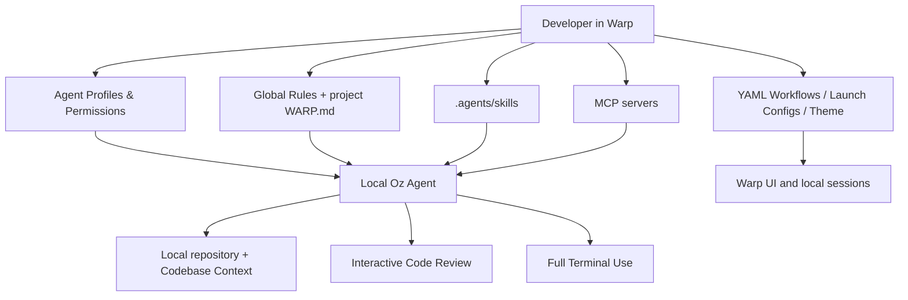
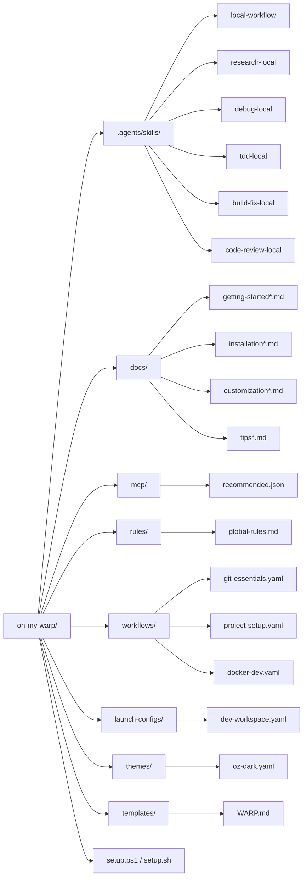

# oh-my-warp

[](LICENSE)
[](https://warp.dev)

> **Your Warp is not alone.**

**English** | [한국어](README-ko.md)

`oh-my-warp` is a local-first enhancement kit for **official Warp / Oz capabilities**.

It is designed for people who want a stronger Warp setup without relying on undocumented internals, custom hook engines, tmux worker orchestration, or companion runtimes. Everything in this repository is shaped around the documented local surfaces that Warp exposes today.

## Why this repository exists

A lot of "agent power-user" setups mix together three very different things:

1. **official Warp capabilities**
2. **custom shell / tmux automation**
3. **tool-specific private conventions or workarounds**

That makes it hard to know what is truly portable, supportable, and safe to share with a team.

`oh-my-warp` takes the opposite approach:

- keep the workflow **local-first**
- keep the customization **officially documented**
- keep the changes **minimal and inspectable**
- keep the setup **usable on macOS, Windows, and Linux**

## Scope

### Included

This repository leans on the local Warp features that are officially documented today:

- reusable **Skills**
- persistent **Rules**
- **MCP servers** as the tool / plugin layer
- **Agent Profiles & Permissions**
- built-in **Planning** and **Task Lists**
- **Full Terminal Use**
- **Interactive Code Review**
- **Codebase Context**
- **YAML Workflows**
- **Launch Configurations**
- the local **Oz CLI**

### Explicitly out of scope

This repository intentionally does **not** depend on:

- undocumented Warp internal directories
- a custom hook engine
- tmux-based worker orchestration
- a companion control plane or runtime
- hidden state files or background daemons
- third-party agent wrappers used as a workaround for missing native features

## Architecture at a glance

The repo is organized around a small number of official Warp surfaces.



## Repository codemap

This diagram shows how the repository is structured and what each area is responsible for.



## What's inside

| Component | Description | Count |
|-----------|-------------|-------|
| **Native-only skill pack** | Focused local Oz skills in official discovery directories | 6 skills |
| **WARP.md template** | Project rules template for local Oz workflows | 1 template |
| **Workflows** | Reusable command shortcuts for git, docker, and project setup | 3 workflow files |
| **Theme** | Dark theme with teal accents | 1 theme |
| **Launch config** | Multi-tab local workspace layout | 1 config |
| **Global rules** | Copy-paste rules for Warp Drive | 9 rules |
| **MCP configs** | Valid local MCP server configurations | 7 servers |
| **Guides** | Installation, customization, getting started, and power-user docs in English and Korean | 8 docs |

## Requirements

- [Warp terminal](https://warp.dev) installed and running
- Git
- (Optional) Node.js — for MCP servers that use `npx`
- (Optional) Docker — for the GitHub MCP server
- (Optional) Oz CLI — included with Warp and useful for headless local runs

## Quick start

> **New to oh-my-warp?** Start with:
> - [Getting Started (English)](docs/getting-started.md)
> - [시작하기 (한국어)](docs/getting-started-ko.md)

### Windows (PowerShell)

```powershell
git clone https://github.com/hongvincent/oh-my-warp.git
cd oh-my-warp
.\setup.ps1
```

### macOS / Linux

```bash
git clone https://github.com/hongvincent/oh-my-warp.git
cd oh-my-warp
chmod +x setup.sh
./setup.sh
```

## What gets installed where

| Surface | Windows | macOS | Linux |
|---------|---------|-------|-------|
| **Skills** | `%USERPROFILE%\\.agents\\skills\\` | `~/.agents/skills/` | `~/.agents/skills/` |
| **Workflows** | `%APPDATA%\\warp\\Warp\\data\\workflows\\` | `~/.warp/workflows/` | `~/.local/share/warp-terminal/workflows/` |
| **Themes** | `%APPDATA%\\warp\\Warp\\data\\themes\\` | `~/.warp/themes/` | `~/.local/share/warp-terminal/themes/` |
| **Launch configs** | `%APPDATA%\\warp\\Warp\\data\\launch_configurations\\` | `~/.warp/launch_configurations/` | `~/.local/share/warp-terminal/launch_configurations/` |
| **WARP.md template** | `%USERPROFILE%\\.warp\\templates\\` | `~/.warp/templates/` | `~/.warp/templates/` |

## First 10 minutes after install

1. **Add global rules**
   - open Warp
   - type `/add-rule`
   - paste the rules from `rules/global-rules.md`

2. **Add MCP servers**
   - open Warp's MCP server settings
   - add or import `mcp/recommended.json`
   - if you only want one server at first, start with **Context7**

3. **Copy `WARP.md` into a project**
   - use the installed template from `~/.warp/templates/WARP.md` or `%USERPROFILE%\.warp\templates\WARP.md`
   - fill in the `[CUSTOMIZE]` sections with real project details

4. **Create a profile**
   - Prod mode for cautious or sensitive work
   - Default for normal local coding
   - YOLO mode for highly trusted sandboxes

5. **Enable the extras you care about**
   - theme
   - launch configuration
   - workflows
   - MCP servers relevant to your stack

## Skill pack

All bundled skills are designed for **documented local Oz features only**.

| Skill | Purpose | Typical prompt |
|-------|---------|----------------|
| `local-workflow` | Structured explore → plan → execute → verify for local work | `/local-workflow Update the install docs and stop after validation.` |
| `research-local` | Documentation and API research with MCP + codebase context | `/research-local Compare our current SDK usage with the latest docs.` |
| `debug-local` | Reproduce, diagnose, fix, and verify local issues | `/debug-local The settings page crashes the dev server.` |
| `tdd-local` | Test-first implementation loop | `/tdd-local Add validation for empty email input.` |
| `build-fix-local` | Minimal-diff build, lint, and typecheck repair | `/build-fix-local Fix the current typecheck failures with minimal changes.` |
| `code-review-local` | Local diff review using Warp's code review workflow | `/code-review-local Review the current diff for risk and missing verification.` |

## How the repo maps to Warp features

| Repo artifact | Warp feature it feeds | Why it exists |
|---------------|-----------------------|---------------|
| `.agents/skills/` | Skills | Reusable workflows for local Oz tasks |
| `rules/global-rules.md` | Rules / Warp Drive | Persistent constraints and expectations |
| `templates/WARP.md` | Project rules | Project-specific context for Oz |
| `mcp/recommended.json` | MCP servers | Docs, GitHub, and external tool access |
| `workflows/*.yaml` | YAML workflows | Repeatable commands in Warp's workflow UI |
| `launch-configs/*.yaml` | Launch configurations | Multi-tab local workspaces |
| `themes/*.yaml` | Themes | Consistent Warp appearance |
| `setup.ps1`, `setup.sh` | Installation | Copy official assets into documented directories |

## Daily usage recipes

### 1. Start work in a new repository

- install the kit
- copy `WARP.md`
- add global rules
- enable the MCP servers you actually need
- open the repo in Warp and let Codebase Context index it

### 2. Do a structured implementation

```text
/plan Add a local-only review workflow and stop for approval.
```

```text
/local-workflow Implement phase 1 of the approved plan and run validation.
```

### 3. Research before coding

```text
/research-local Use Context7 to check the latest framework docs before editing the integration.
```

### 4. Fix a failing build

```text
/build-fix-local Run the current build command, group related failures, and fix them with the smallest diff possible.
```

### 5. Review your current diff

```text
/code-review-local Review the current diff for logic risk, missing tests, and verification gaps.
```

### 6. Run headless with the CLI

```bash
oz agent run --prompt "Summarize the repository structure and suggest a safe first task."
```

```bash
oz agent run --mcp ./mcp/recommended.json --prompt "Use Context7 to review the latest SDK docs before editing code."
```

## Cross-platform notes

This repository is intentionally careful about cross-platform behavior.

- **Windows uses `setup.ps1`** and installs everything to documented user-level Warp directories.
- **macOS / Linux use `setup.sh`** and the same official skill discovery layout.
- **Project setup workflows** were written to avoid POSIX-only shell assumptions where practical.
- **Git branch cleanup** is intentionally exposed as a _candidate listing_ workflow instead of a shell-specific deletion pipeline.
- **Launch config colors** use documented values only.
- **Documentation examples** now include Windows-specific copy paths where that matters.

## Repository walkthrough

### `.agents/skills/`

The native-only heart of the repo.

- `local-workflow` — general implementation discipline
- `research-local` — docs-first investigation
- `debug-local` — reproduce → diagnose → fix → verify
- `tdd-local` — red → green → refactor
- `build-fix-local` — minimal repair loop for build/test/typecheck failures
- `code-review-local` — structured diff inspection

### `docs/`

Human-readable guidance for installing, customizing, and using the kit.

- `getting-started*.md` — first-run path
- `installation*.md` — OS-specific install details
- `customization*.md` — extending skills, workflows, and themes
- `tips*.md` — power-user guidance for profiles, MCP, planning, and code review

### `mcp/recommended.json`

A valid MCP config bundle you can import into Warp or pass to `oz agent run --mcp`.

### `rules/global-rules.md`

Copy-paste global rules for Warp Drive. These shape Oz's persistent default behavior across repositories.

### `workflows/`

Reusable YAML workflows for:

- git inspection and commit helpers
- docker development loops
- project setup tasks

### `launch-configs/dev-workspace.yaml`

A starter multi-tab workspace for coding, servers, tests, and general terminal work.

### `templates/WARP.md`

A project-level rules template. This is the highest-leverage artifact in the repo after the skill pack.

## Verification model

This repo is opinionated about verification.

Whenever you extend it, the default expectation should be:

1. **explore first**
2. **plan when complexity is non-trivial**
3. **implement with minimal diff**
4. **validate before claiming success**

In practice that usually means checking, in order:

1. build / compile
2. lint / typecheck
3. tests
4. functional fit to the original request

## Documentation index

- [Installation](docs/installation.md)
- [Customization](docs/customization.md)
- [Getting Started](docs/getting-started.md)
- [Power Tips](docs/tips.md)
- [설치 가이드](docs/installation-ko.md)
- [커스터마이징 가이드](docs/customization-ko.md)
- [시작하기](docs/getting-started-ko.md)
- [파워 팁](docs/tips-ko.md)

## Philosophy

This project keeps the useful discipline from structured agent workflows while staying inside official local Oz capabilities:

1. **Explore** before acting
2. **Plan** when the task is complex
3. **Verify** before claiming completion
4. **Prefer minimal changes**
5. **Use official capabilities, not hidden internals**

## Contributing

Contributions are welcome.

1. Fork the repository
2. Create a feature branch (`git checkout -b feat/my-feature`)
3. Keep changes aligned with documented local Oz capabilities
4. Update the docs when behavior changes
5. Submit a pull request

## Credits

Inspired by the structured workflow ideas popularized by the broader AI coding tooling ecosystem, including:

- [oh-my-claudecode](https://github.com/Yeachan-Heo/oh-my-claudecode)
- [oh-my-codex](https://github.com/Yeachan-Heo/oh-my-codex)

## License

[MIT](LICENSE)
